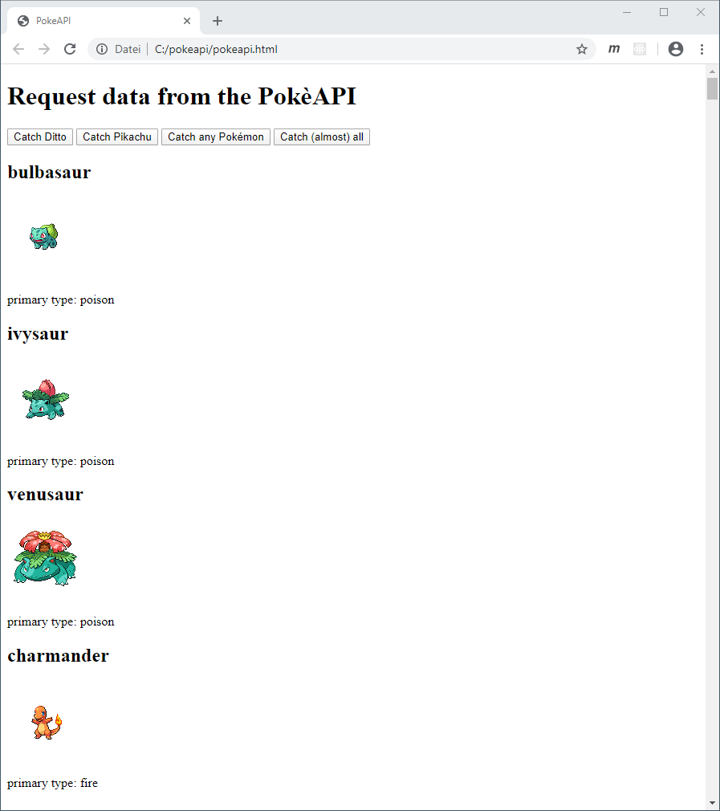

# PokéAPI

## Task 1: Catch Ditto & Pikachu

Implementieren Sie folgende Funktionen in `pokeapi.ts`:

- `loadPokemon(name: string): Promise<void>`: Fragt das Pokémon von der *PokéAPI* ab und zeigt es mit `showPokemon()` an. Achtung: Diese Funktion ist asynchron!
- `showPokemon(pokemon: any): void`: Zeigt das übergebene Pokémon in dem `div` mit der ID
  `pokemon-container` an.
  - Name als `h2`
  - Bild (`pokemon.sprites.front_default`)
  - Primärtyp als `p` (`pokemon.types[0].type.name`)

Passen Sie `pokeapi.html` an, sodass per Klick auf die entsprechenden Buttons *Ditto* bzw. *Pikachu* angezeigt wird.

## Task 2: Catch any Pokémon

Implementieren Sie in `pokeapi.ts` die asynchrone Funktion `loadRandomPokemon(): Promise<void>`, die zufällig eines der ersten 150 Pokèmon abfragt und anzeigt.

Rufen Sie die Funktion bei einem Klick auf den entsprechenden Button auf.

## Task 3: Catch (almost) all Pokémon

Implementieren Sie in `pokeapi.ts` die asynchrone Funktion `loadManyPokemon(): Promise<void>`, welche die ersten 150 Pokèmon abfragt und anzeigt.

Rufen Sie die Funktion bei einem Klick auf den entsprechenden Button auf.

## Task 4: Styling

Gestalten Sie mit *CSS* das Erscheinungsbild der Seite und verwenden Sie dabei insbesondere *CSS-Flexbox*.

